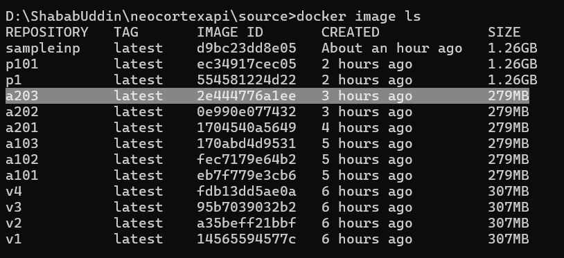
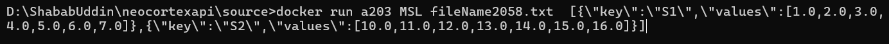

NeoCortexAPI Containerization
==============================
Pre-requisite:
1. Visual Studio IDE
2. .NET8 Framework
3. Docker Desktop
4. Visual Studio Code

## Environment Setup - .NET Part:
1. Clone the project from https://github.com/uddin-shahab/neocortexapi/tree/development
2. Open Visual Studio and open solution NeoCortexApi.sln
3. Rebuild Solution from Build menu
4. Make sure Docker Desktop is running
5. Open Terminal and run command "docker ps" to check if it's running properly

6. In Terminal go-to folder location where Dockerfile is location e.g. D:\ShababUddin\neocortexapi\source>
7. Build Docker image by running command "docker build -t a203 ." -t is used to tag image and you can use any word to tag your image
8. Once image creation is completed run the command to check your created image "docker image ls"

9. Run container by using following command

##### For SpatialPatternLearning

    D:\ShababUddin\neocortexapi\source>docker run a203 SPL fileName2058.txt 

##### For MultiSimpleSequenceLearning

    D:\ShababUddin\neocortexapi\source>docker run a203 MSSL fileName2058.txt  [{\"key\":\"S1\",\"values\":[1.0,2.0,3.0,4.0,5.0,6.0,7.0]},{\"key\":\"S2\",\"values\":[10.0,11.0,12.0,13.0,14.0,15.0,16.0]}]

##### For MultiSequenceLearning

    D:\ShababUddin\neocortexapi\source>docker run a203 MSL fileName2058.txt  [{\"key\":\"S1\",\"values\":[1.0,2.0,3.0,4.0,5.0,6.0,7.0]},{\"key\":\"S2\",\"values\":[10.0,11.0,12.0,13.0,14.0,15.0,16.0]}]

The above command will generate a Text file in Docker container with all the SDR values produced by NeocortexApi. See screenshot below:

Right click on file and click "Save" to save this file to your computer.

Now open the same file in any text editor e.g. Notepad++, copy the SDR values and save SDR values to another empty file and save it with name sampleinput.txt. This file will be used in later stage.

## Environment Setup - Python Part:
1. Open Visual Studio Code and open Python folder e.g. "D:\ShababUddin\neocortexapi\Python"
2. Open Terminal and go-to folder "D:\ShababUddin\neocortexapi\Python"
3. Run the command "docker build -t sampleinp ." to create python project image

4. Run command "docker image ls" to check if image has been created successfully

5. In order to run container, run the following command. Note that highlighted part of sampleinput.txt is the same file on your computer we save from .NET step earlier. It's called volume mount.

    D:\ShababUddin\neocortexapi\Python>docker run -v D:\ShababUddin\neocortexapi\Python\ColumnActivityDiagram\sampleinput.txt:/ColumnActivityDiagram/sampleinput.txt  sampleinp -fn "sampleinput.txt" -gn "sampleinput" -mc "19" -ht "8" -yt "yaxis" -xt "xaxis" -min "50" -max "4000" -st "'single column'" -fign "CortialColumn" -a

6. Once above step is completed, now you can see a file created inside the earlier running container. See the image below:

Now you can see one file is mounted and a new file is created for the mounted SDR values file.

7. Right click on newly created file "sampleinput1.html" and save it on computer